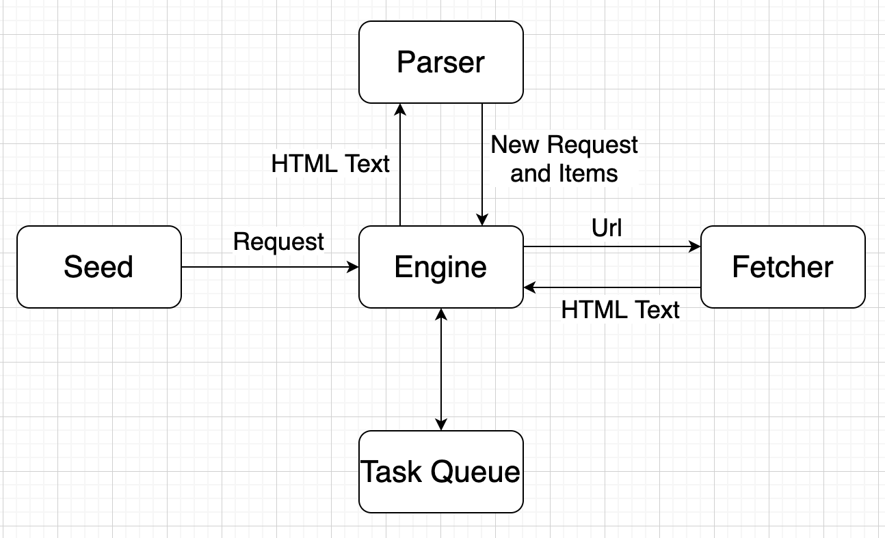
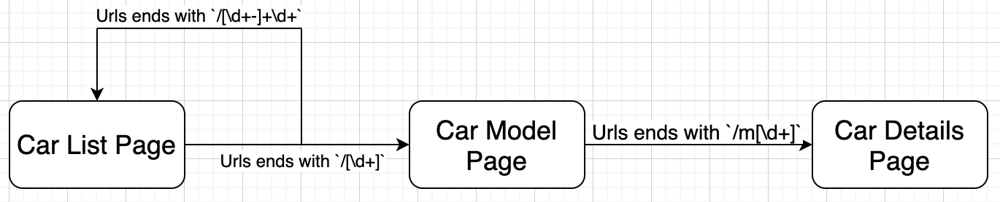
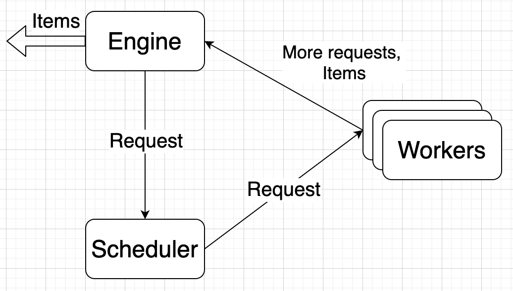
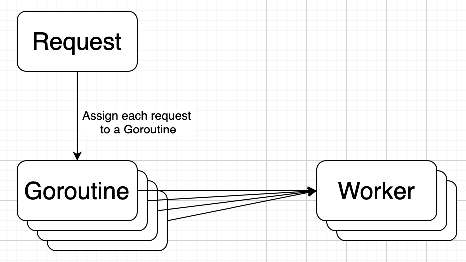
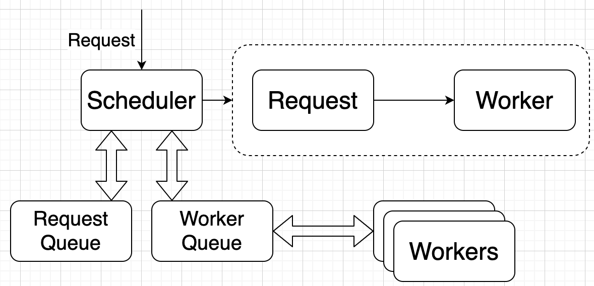
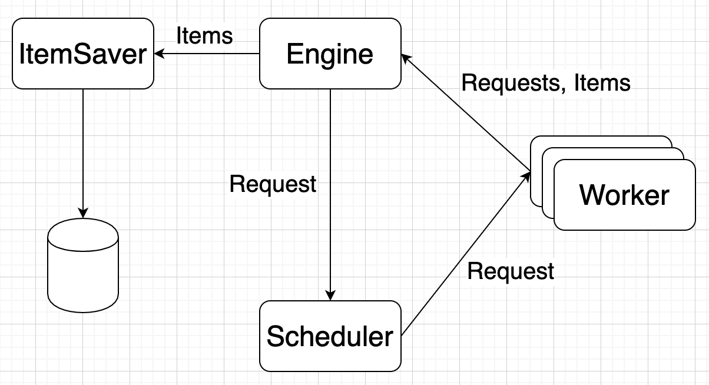
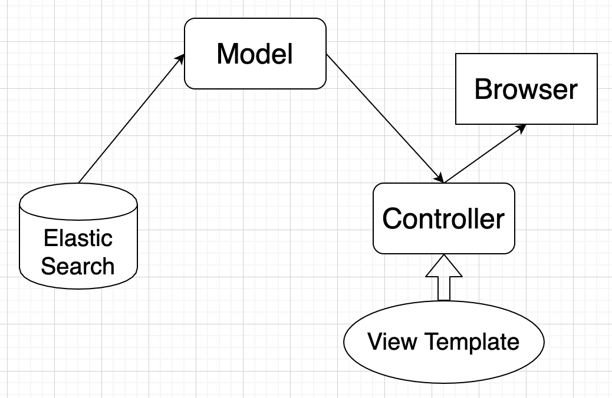
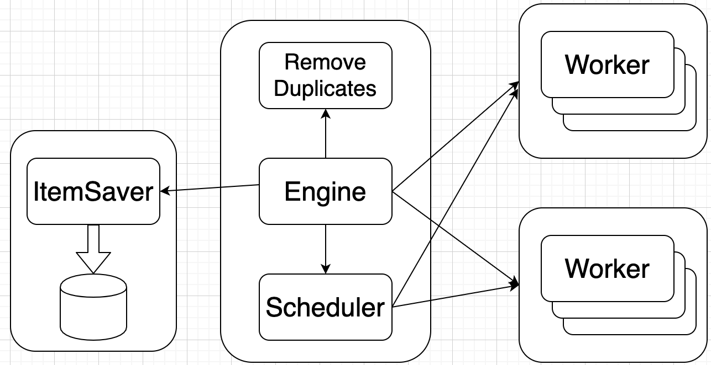
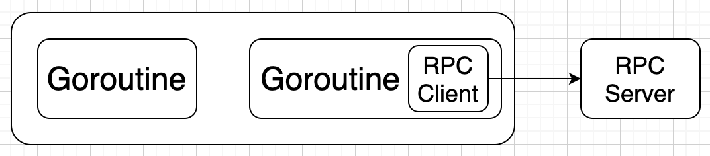
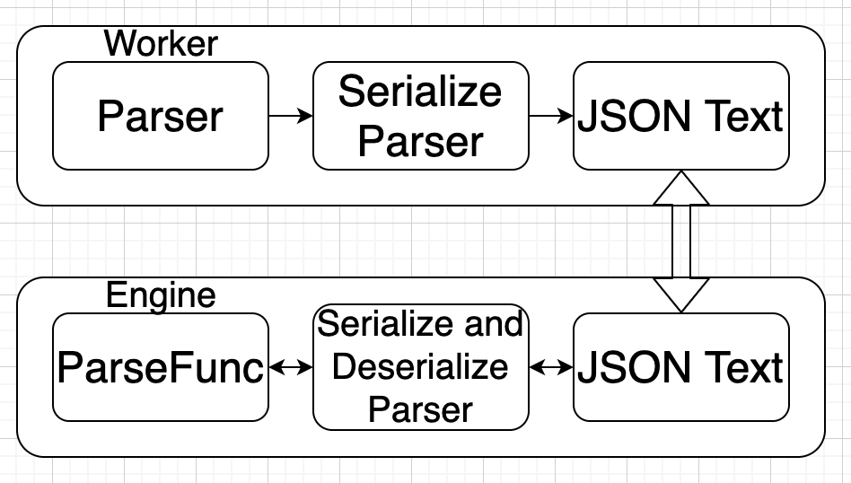

# Introduction into Go Programming Language

## Installation and Configuration

  * Official website: https://golang.org/. And download the installation package from the website and install.
  * Confirm `go` has been successfully installed by typing in
    ```
    Yus-MacBook-Pro:~ yyu196$ go version
    go version go1.13.7 darwin/amd64
    ```
  * Turn on `GO111MODULE` and install `golangimports` dependency by typing in
    ```
    Yus-MacBook-Pro:~ yyu196$ go env -w GO111MODULE=on
    Yus-MacBook-Pro:~ yyu196$ go get -v golang.org/x/tools/cmd/goimports
    ```
  * Install all `go` related extensions in Visual Studio Code.
  * Create `go.mod` file under `./` by typing in
    ```
    Yus-MacBook-Pro:GoLangIntro yyu196$ go mod init FundamentalGrammer
    ```
    Suppose we have a simple helloworld go file called `FundamentalGrammer` directory, and we can run the file under `./` which contains `go.mod` by typing
    ```
    Yus-MacBook-Pro:GoLangIntro yyu196$ go run FundamentalGrammer/basic.go 
    Hello World
    ```
  * Setup proxy in Mainland China. Go to https://github.com/goproxy/goproxy.cn/blob/master/README.zh-CN.md. Default proxy is `GOPROXY="https://proxy.golang.org,direct"`. Type in 
    ```
    go env -w GOPROXY=https://goproxy.cn,direct
    ```
  * Install gin framework by entering command `go get -u github.com/gin-gonic/gin`.
  * Install zap library entering command `go get -u go.uber.org/zap`

## Install ElasticSearch inside a Docker
  * Docker is written in `Go` programming language, directly go to `https://hub.docker.com/editions/community/docker-ce-desktop-mac` to download stable version binary of the Docker software.
  * In mainland China, we need to use a new registry to pull `Docker`'s mirror. In `Docker` desktop -> Preferences setup, go to docker engine tab, and add `"registry-mirrors": ["http://f1361db2.m.daocloud.io"]` as a new item in the JSON object. When running `docker info`, the new registry mirror is expected to be seen. Please go to `https://www.daocloud.io/mirror#accelarator-doc` for more details.
  * Install Elastic Search in `Docker` by typing in the following command in Terminal.

    ```
    docker pull docker.elastic.co/elasticsearch/elasticsearch:7.6.1
    ``` 

  * Run Elastic Search in Single Node mode by typing in the following command in Terminal.
  
    ```
    docker run -p 9200:9200 -p 9300:9300 -e "discovery.type=single-node" docker.elastic.co/elasticsearch/elasticsearch:7.6.1
    ```

  * Delete an index from ElasticSearch docker by executing `curl -XDELETE 'localhost:9200/car_profile'`.

  * In Elastic Search, `index` acts as a DB Name and a table and `id` acts like an entry into the table. Idea of type was removed in Elastic Search 7.

## Project: Implement a `go` web crawler on an car information website
### Milestone 1: Single Thread web crawler
  * Create a `/SingleThreadCrawler` directory to store source codes.
  
  * Diagrams of the system

    

  * Fetcher implemetation details
    * Install Go Text library by entering `go get -u golang.org/x/text` in the command line.
    * The Kanji is in a wrong encoding way, we need to do conversion. Call `transform.NewReader` on the original response body to Convert its decoder from `GBK` to `UTF-8`.
    * For code scalable reason, we also need to install Go Net library by entering `go get -u golang.org/x/net`. This library offers a functionality to detect the decoder from an html text.
    * Create a new `determineEncoding` that takes in an response body `io.Reading` and return `encode.Encoding` that includes the decoder format.
  * Parser Implementation Diagram
  
    

  * Wrap `parser` functionality as a struct in `engine/types`. Create the struct with parse function object and the name of the function. Expose the method to parse contents with Items and more urls in the parse function return.

### Milestone 2: Concurrent web crawler
  * Merge functionality of Fetcher and Parser into a worker function in `engine`. 
  * For concurrent web crawler, we will simplement a scheduler that schedule `worker`s in the `engine`'s `Run` function.
  * `engine` will send `Request`s to scheduler and scheduler will coordinate `worker`s to send request and parse information. Please refer to the diagram below.

    

  * A simple Scheduler will create a `goroutine` for each Request and have a single worker to act on all `goroutine`s. Please refer to the diagram below.

    

  * A Queued Scheduler set up two queues one for worker and the other for request. When a new worker or request comes it, it will add that worker or request item at the back of the queue. When we need the worker to work on the request, we pop both front item from Request and Worker Queue and feed request item into worker item which is a Channel of request, in `engine/worker`, the worker function is going to fecth and parse the request. Please refer to the diagram below. 
  
    

### Milestone 3: Save crawler result and UI display
  * The following diagram illustrate how `ItemSaver` works in the project architecture.

    

  * Install Elastic Search client library, go to `https://github.com/olivere/elastic`. Type in `go get github.com/olivere/elastic/v7` to install Elastic Search 7's client library.
  * Create a `save()` function in `persist/itemsaver.go` to save crawled items into Elastic Search system.
  * Architecture for UI Display

    

### Milestone 4: Make Crawler Distributed
  * The following diagram shows the architecture of a distributed crawler.

    

  * Current data flows under channels under a single instance of crawler. Next, we will use RPC Client and RPC Server to split `ItemSaver` logic into some distributed services. Please refer to the architecture below.

    

  * We need put `ItemSaver` into a separate service and expose Rpc call (`ItemSaverService.Save`) to the main engine.
  * We also need to put `worker` into a separate service and expose Rpc call (`CrawlService.Process`) to the main engine. However, the data communicated between CrawlService and engine needs to be serialize and deserialize. Please refer to the diagram below.

    